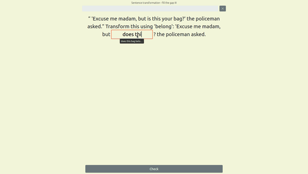
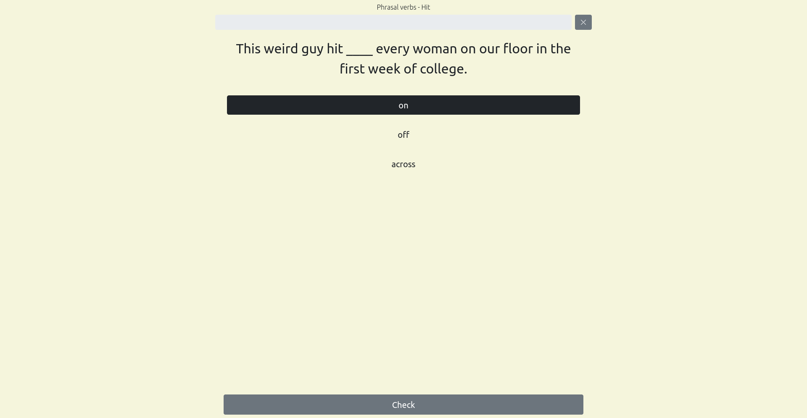
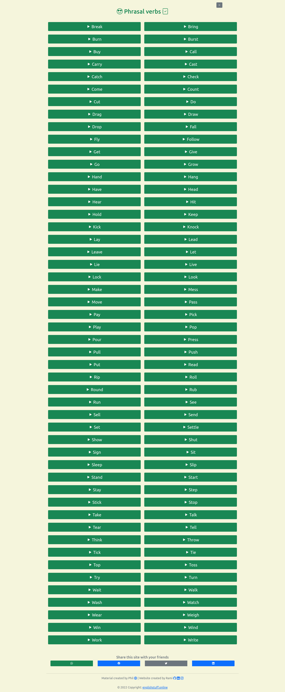

# [:oncoming_taxi: :uk: :us: englishstuff.online :uk: :us: :statue_of_liberty:](https://www.englishstuff.online "check out the site and practice English with quizzes")  

:globe_with_meridians: This is a website where you can learn and practice English with quizzes :books:
* It is totally free :100:
* No registration is required :white_check_mark:

## Here are some screenshots:

### :arrow_forward: Select your topic and its Difficulty

### :pencil2: Example: Practice your phrasal verbs

